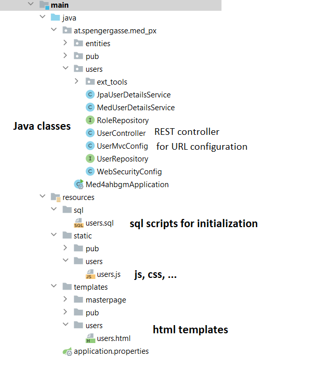

# medical practice system
The aim of this project is to create a medical practice system.
A basic structure is already in place. This contains the following functionalities:

- a master page, which contains the menus for the individual pages. The interaction between the individual 
page and the master page works with the Thymeleaf template engine.
The page ```/resources/templates/users/users.html``` shows how this works.
- a login mechanism using Spring Security mechanisms

## Adding new functionality
In order to realize a project with many contributors with as little chaos as possible, 
it is necessary that everyone adheres to a few rules.

Here you can see the basic structure of the project:



Put your java classes in a sub package of ```at.spengergasse.mex_px```.

Put your HTML pages in a subfolder of ```resources/templates```.

Put static resources (scripts, stylesheets, ...) in a subfolder of ```resources/static```.


### HTML pages
The Thymeleaf mechanism works in such a way that HTML pages must be located in the ```resources/templates``` folder.

Create a separate subfolder in ```resources/templates``` for your functionality. 
It contains the HTML pages for this functionality.
For example, there is a subfolder users for user administration.

The following content is required to ensure that the HTML page fits in well with the master page:

- In the ```<head>``` section, the following entry automatically integrates common libraries 
    such as Bootstrap and JQuery
    ```
    <th:block th:insert="~{masterpage/masterpage :: assets}"/>
    ```
  
- The following entry at the beginning of the ```<body>``` causes menus to be inserted:
    ````
    <div th:replace="~{/masterpage/masterpage :: menu}"/>
    ````

- The following entry at the end of ```<body>``` causes the common footer to appear at the end of the page:
    ````
    <section th:replace="~{/masterpage/masterpage :: footer}"/>
    ````

<mark>IMPORTANT:</mark>Your HTML page must not be called up directly, 
but must first be processed by Thymeleaf. 
Therefore, it will not work properly if you enter the URL http://localhost:8080/templates/users/users.html, for example.

Instead, you have to write a WebMvcConfigurer for your page. 
This defines a route for Thymeleaf via which your page is called. 
Only in this way will the page be processed by Thymeleaf before it is sent to the browser. 

The following WebMvcConfigurer would map the URL ```/example/test``` to the template 
page ```/templates/myexample/mytest.html```.
It would also map the URL ```/abc/def/``` to the template page ```/templates/uvw/xyz.html```:
````
@Configuration
public class ExampleMvcConfig implements WebMvcConfigurer {
    public void addViewControllers(ViewControllerRegistry registry) {
        registry.addViewController("/example/test").setViewName("/myexample/mytest");
        registry.addViewController("/abc/def").setViewName("/uvw/xyz");
    }
}
````

Finally you should add a new Menu item to the master page which contains a link to your URL mapping. 
The master page is located in the folder ```resources/templates/masterpage```:

````
                <!--------------- menu items for admins ---------------->
                <ul class="nav navbar-nav" sec:authorize="hasRole('ADMIN')">
                    <li><a href="/admin/users">Users</a></li>
                </ul>
                <!--------------- menu items for doctors ---------------->
                <ul class="nav navbar-nav" sec:authorize="hasRole('DOCTOR')">
                    <li><a href="/doctor/patients">Patients</a></li>
                </ul>
````
(Note: the URL ```/doctor/patients/``` is not mapped yet)


### URL conventions
There will be 2 roles in the system: ADMIN and DOCTOR.

(If you are interested in the security configuration you may want to study the contents of class 
```at.spengergasse.mex_px.users.WebSecurityConfig```.
You can also read this tutorial for details: https://spring.io/guides/gs/securing-web/)

To keep the configuration of access authorizations as simple as possible, 
the following convention for URLs should be adhered to:

All URLs intended for the ADMIN role should begin with /admin/... if it is a template. 
If it is a URL for a REST service, it should begin with /api/admin/... .

Similarly, URLs should begin with /doctor/... or /api/doctor/... if the access is to be for the DOCTOR role


### Scripts and Cascading Stylesheets
For your scripts and CSS files you need to add a subfolder to the ```/resources/static``` folder. 

In your HTML page you reference the script or CSS file using an absolute path. Example 
(script ```users.js``` is located in folder ```resources/static/users/```):
```
<script src="/users/users.js"></script>
```

### Entity classes
As the entity classes are required by all developers, they should all be located in the package 
```at.spengergasse.mex_px.entities```

### Other Java classes
Create a sub-package for all your other Java classes in the package at.spengergasse.mex_px.
This should contain all your classes (controllers, repostiories, ...) except entities.